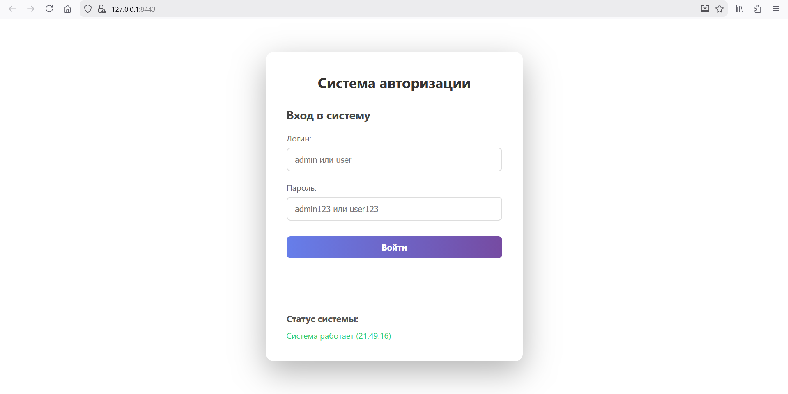

## Cистема резервирования объектов на FastAPI

На данный момент проект представляет собой полностью рабочий пример системы аутентификации с использованием FastAPI, JWT-токенов и самоподписанного SSL-сертификата.


Два хардкодных пользователя:
- admin / admin123 → роль administrator
- user  / user123  → роль user

Оссобенности:
- Выдача JWT-токена сроком действия 30 минут
- Одностраничный фронтенд с формой входа, профилем и индикатором статуса системы
- Сервер работает только по HTTPS (порт 8443)

### Структура проекта
```
textproject/
├── main.py          # основной файл FastAPI
├── auth.py          # логика JWT и аутентификации
├── models.py        # Pydantic-модели и список пользователей
├── frontend/
│   ├── index.html
│   ├── style.css
│   └── script.js
├── resources/       # директория для размещения SSL-сертификатов 
│   ├── server.key
│   └── server.crt
└── static/          # автоматически монтируется из папки frontend
```
### Инструкция по запуску

#### 1. Склонировать или скачать репозиторий
```bash
git clone https://github.com/n1ck-L/python_dsl.git
```
#### 2. Убедиться, что установлен Python ≥ 3.9

#### 3. Создать и активировать виртуальное окружение:
```bash
Bashpython -m venv venv
source venv/bin/activate          # Linux/macOS
# или
venv\Scripts\activate             # Windows
```

#### 4. Установить зависимости:
```Bash
pip install -r requirements.txt
# или
python -m pip install -r requirements.txt
```
#### 5. Создать папку для сертификатов и сгенерировать самоподписанный сертификат:

```Bash
mkdir resources
cd resources
```

#### 6. Генерация самоподписанного сертификата:

#### 6.1. Генерируем приватный ключ сервера (аналог ca.key)
```bash
openssl genrsa -out server.key 4096
```

#### 6.2. Создаём самоподписанный сертификат сервера (он же будет и корневым CA для клиента)
```bash
openssl req -new -x509 \
    -key server.key \
    -out server.crt \
    -days 3650 \
    -subj "/C=RU/ST=Moscow/O=Test CA/CN=localhost" \
    -addext "subjectAltName = DNS:localhost, DNS:*.localhost, IP:127.0.0.1"
```

#### 6.3. Проверка того, что получилось (опционально) 
```bash
openssl x509 -in server.crt -text -noout | grep -E "Subject:|Issuer:|DNS:|IP Address"
```

После выполнения команды в каталоге resources/ появятся файлы server.key и server.crt.

#### 7. Запустить приложение:

```Bash
cd ..
python main.py
```

#### 8. Открыть в браузере адрес: https://0.0.0.0:8443
! Браузер покажет предупреждение о самоподписанном сертификате — необходимо принять его (кнопка «Продолжить», «Принять риск» и т.п.).




### Где искать нужный код при дальнейшем развитии

- Изменить/добавить/удалить пользователей — models.py словарь USERS
- Изменить время жизни токена — auth.py константа ACCESS_TOKEN_EXPIRE_MINUTES
- Добавить новые endpoint — main.py
- Доработать фронтенд — frontend/script.js - основная логика, frontend/style.css - стили, frontend/indes.html - описание страницы
